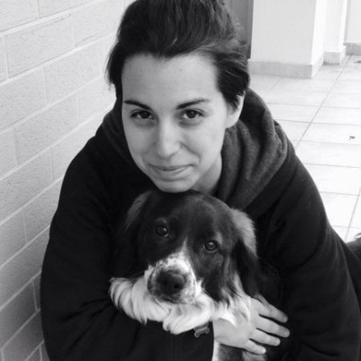

# About 

## About the author

{ width=250 }

Hello all,

My name is Anna! I started climbing 3 years ago and I really love it. I wouldn’t say I am a great climber but I always seek ways to improve my technique and become stronger both physically and mentally.

During my climbing journey I have read several books. Sometimes however it’s hard to remember everything I learn and I would love to have something like a notebook to access this valuable information. And why not sharing it to other climbers too?

That’s why I decided to build the Crux Notes. My goal is not only to share this knowledge but also to make sure it’s quality one. We all know about the "bro science", the kind of advice that gets passed around a lot but isn’t always backed by real evidence.

For more personal opinions, we have the blog section, where you can share your own journey and the things that have helped you along the way.

## Open source

This is an open source project. Feel free to [contribute on GitHub](https://github.com/tsolakoua/cruxnotes.git) if you want!
