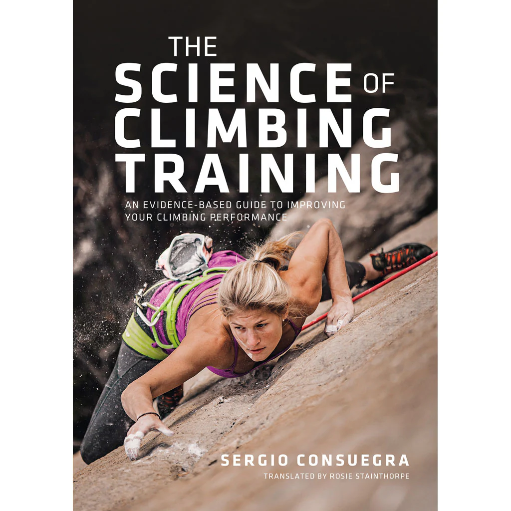
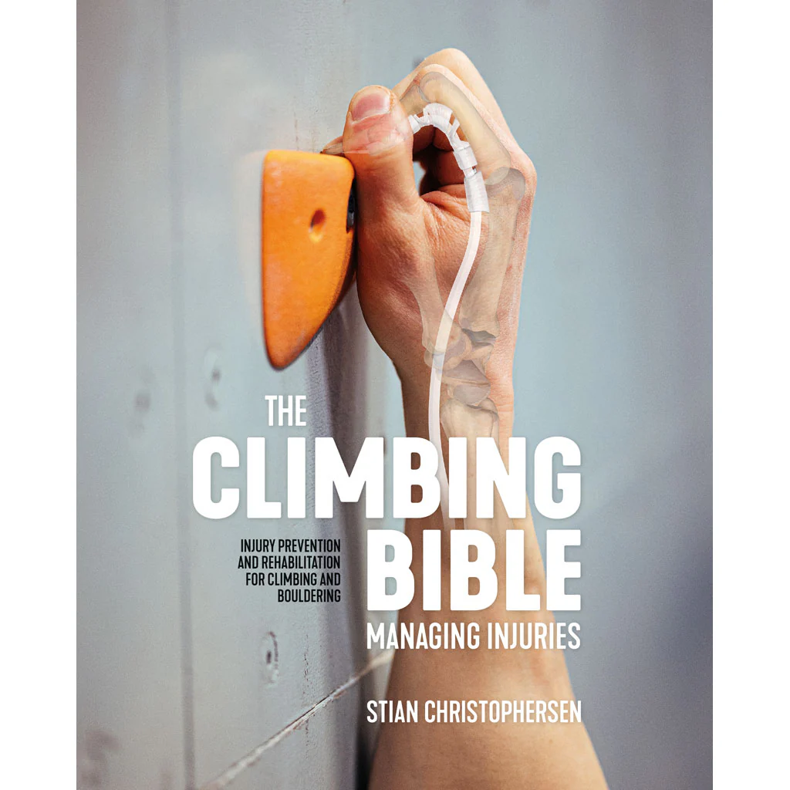

---
date:
  created: 2025-09-26
authors:
  - team
---

# The climbing books that transformed my climbing

In this article I would like to share with you my go-to climbing books.
<!-- more -->

What I love about climbing is how closely it’s connected to understanding how the body works and learning how to take care of it. These two books became my go-to guides: one taught me how to train better for strength, and the other how to prevent and deal with injuries.

### [The science of climbing training: An evidence-based guide to improving your climbing performance](https://www.adventurebooks.com/products/the-science-of-climbing-training)
Author: [Sergio Consuegra](https://www.instagram.com/sergioccafyde/)

{ width=400 }

This is my favorite book. First of all it really helped me understand how the body produces energy during climbing, for example when the aerobic energy system and when not. I also gained a clear understanding of which muscles are the most important for climbing, how to build strength, and the different methods of training. Most of the workouts I do to get stronger come from this book, and I feel much stronger as a result. It guided me in choosing specific exercises which helped me bring more focus to my training.

### [The Climbing Bible: Managing Injuries](https://www.adventurebooks.com/products/the-climbing-bible-managing-injuries)
Author: [Stian Christophersen](https://www.instagram.com/stianchristophersen/)

{ width=400 }

This is another book I really like. It explains the most common climbing injuries and how to treat them in a clear and practical way. Reading it helped me understand my body much better. Of course, I still go to a physio when I feel pain to get my injuries checked, but now I have a broader perspective and understanding. I think every climber should be aware of the types of injuries that can happen and mainly how to prevent them.

 

